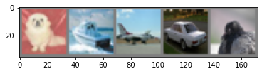
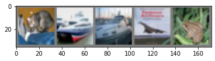

The past 2 weeks have been a blur, wherein I read papers that significantly advanced my understanding of the evolution of deep learning research and, more broadly, how to learn.

The **Pareto principle**, or the **80/20 rule**, is a heuristic rule, derived from the application of a power law distribution, a general rule of thumb that 80% of "results" come from 20% of "inputs." In computing, there have been several anecdotes related to this rule. For instance, in 2002, \[Microsoft](https://www.crn.com/news/security/18821726/microsofts-ceo-80-20-rule-applies-to-bugs-not-just-features.htm) reported that 80% of crashed in Windows were caused by 20% of present bugs. Similarly, it was found that 80% of  code can be written in 20% of total allocated time. The examples exceed my allocated space here.

Approaching my learning in this manner has helped me make progress in my learning, focusing on the big concepts, and leaving the remaining 20% of material, which I consider the details, to later down the line. 

In my first notebook implementation, I followed the same rule. That is, this lead-in was a long form excuse for getting my primitive ResNet implementation to **~80%** accuracy and moving on.

Below I share some snippets at my implementation attempts. For this purpose, I used the CIFAR-10 dataset. Without further ado, let's jump in.

```python
# Author: Tyna Eloundou
# Package import

# Ordinary Python
import matplotlib.pyplot as plt
import numpy as np

# PyTorch
import torch
import torchvision
import torchvision.transforms as transforms

import torch.nn as nn
import torch.nn.functional as F

import torch.optim as optim
from torch.optim.lr_scheduler import _LRScheduler, Optimizer
```

I had some difficulty rendering JavaScript in my notebook on my Linux virtual machine, so instead of importing the progress bar library **tqdm,** modified with the **partial** package. 

Partial functions allow one to derive a function with x parameters to a function with fewer parameters and fixed values set for the more limited function.

```python
# from tqdm import tqdm_notebook as tqdm
from functools import partial
from tqdm import tqdm
tqdm = partial(tqdm, position=0, leave = True)

```

Here we set the path variables/objects. Make sure to make these relative to current directory, for porting back and forth from GPU.

```python
"""
Define Paths
"""

PATH = './cifar10_resnet.pth'


# PATH=Path('./data/tmp/')
# PATH.mkdir(exist_ok=True)

# model_state_dict = None
```

Setting arguments in this way can be a useful means to track and re-set model training settings.

```python
args = {
    "train_size": -1,
    "val_size": -1,
#     "full_data_dir": DATA_PATH,
    "data_dir": PATH,
    "task_name": "cifar10",
    "no_cuda": False,
#     "output_dir": CLAS_DATA_PATH/'output',
    "do_train": True,
    "do_eval": True,
    "train_batch_size": 5,
    "eval_batch_size": 5,
    "learning_rate": 3e-5,
    "num_train_epochs": 2.0,
    "warmup_proportion": 0.1,
    "local_rank": -1,
    "seed": 42,
    "gradient_accumulation_steps": 1,
    "optimize_on_cpu": False,
    "fp16": False,
    "loss_scale": 128,
    "mean_val": 0.5,
    "sd_val": 0.5
}
```

First, since we are looking at at images, there are several types of transforms that we could apply to our incoming data samples. The **Compose** callable class allows us to stack transformations on top of each other. Here, we might be interested in normalizing the color in our tensor images, with a mean of 0.5 and a standard deviation of 0.5. This is important because we would want to avoid bias in our data hailing from the color distribution in examples, or a set of examples. 

Note that color images have three channels: red, green, and blue. So need to pass three parameters each for normalizing the mean and standard deviations.

```python
# transform
transform = transforms.Compose(
    [transforms.ToTensor(),
     transforms.Normalize((args["mean_val"], args["mean_val"], args["mean_val"]), 
                          (args["sd_val"], args["sd_val"], args["sd_val"]))])
```

Then, we define the batch size to be 5. Then we define the training and test sets, and transforming them. We then load the data, setting **shuffle** to True for the training data to reshuffle after every epoch.

```python
# Download training set from CIFAR10, using the transform defined above
trainset = torchvision.datasets.CIFAR10(root='./data', train=True, download=True, transform=transform)

# Load the data using a dataloader, from the training set, with batchsize 5 and multi processing (workers)
trainloader = torch.utils.data.DataLoader(trainset, batch_size=args["batch_sz"], shuffle=True, num_workers=2)

# Test set
testset = torchvision.datasets.CIFAR10(root='./data', train=False, download=True, transform=transform)

testloader = torch.utils.data.DataLoader(testset, batch_size=args["batch_sz"],  shuffle=False, num_workers=2)
```

From the CIFAR documentation, get the class names. We can abbreviate them or use a shortened version, as long as we do not change the meaning. Note that the labels were initially generated to be mutually exclusive.

```python
#set class names for CIFAR-10

classes = ('plane', 'car', 'bird', 'cat', 'deer',
            'dog', 'frog', 'horse', 'ship', 'truck')

classes2 = ('airplane', 'automobile', 'bird', 'cat', 'deer',
            'dog', 'frog', 'horse', 'ship', 'truck')
```

For the exploratory phase, let us define a function to display our images. We take advantage of matplotlib's **imshow** method to do this. 

Using **iter()** combined with **next()**, we can create iterations of images in our training set to view, and print their true labels just underneath.

```python
# Display pictures


def show_image(img):
    img = img*args["mean_val"] + args["sd_val"]     # unnormalize
    npimg = img.numpy()
    plt.imshow(np.transpose(npimg, (1, 2, 0))) # use imshow to display data as an image, i.e., on a 2D regular raster.
    plt.show()

# get some random training images from the dataloader
dataiter = iter(trainloader) # iter() creates an object which can be iterated one element at a time, esp with next()
images, labels = dataiter.next()

# show images in a batch (click this cell a couple of time to see several batches)
show_image(torchvision.utils.make_grid(images))
# print labels for a batch
print('      '.join('%5s' % classes[labels[j]] for j in range(args["batch_sz"])))
```



Now, we can take the Module class to create our 3-channel images. Her, we have a basic architecture that starts with 3 in-channels and goes in the sequence: 

Conv Layer -> ReLU -> Max Pooling -> Conv Layer -> ReLU -> Max Pooling -> ReLU(Fully Connected) -> ReLU(Fully Connected) -> Fully Connected 


```python
# Define a CNN and modify to take 3-channel images

class Net(nn.Module):
    def __init__(self):
        super(Net, self).__init__()
        self.conv1 = nn.Conv2d(3, 6, 5)  # nn.Conv2d(in_channels, out_channels, kernel_size)
        self.pool = nn.MaxPool2d(2, 2)   # nn.MaxPool2d(kernel_size, stride)    #think about removing the pools
        self.conv2 = nn.Conv2d(6, 16, 5) 
        self.fc1 = nn.Linear(16 * 5 * 5, 120) #nn.Linear(in_features, out_features)
        self.fc2 = nn.Linear(120, 84)
        self.fc3 = nn.Linear(84, 10)

    def forward(self, x):  # forward prop architecture
        x = self.pool(F.relu(self.conv1(x)))  # use conv1, then relu to squish values, then pool
        x = self.pool(F.relu(self.conv2(x)))  # use conv2, then relu to squish values, then pool
        x = x.view(-1, 16 * 5 * 5)            # view method returns a tensor with the same data as the self tensor (the returned tensor has the same number of elements), but with a different shape. 
        x = F.relu(self.fc1(x))               # fully connected layer fc1, then relu
        x = F.relu(self.fc2(x))               # fully connected layer fc2, then relu
        x = self.fc3(x)                       # fully connected layer, corresponds to final output
        return x


net = Net()
```

At this junction, we should think about our choice of loss function and optimizers. 

There are a number of loss criteria and optimizers at our disposal, but we will start with cross-entropy loss and stochastic gradient descent.

```python
# Loss Function and Optimizer
criterion = nn.CrossEntropyLoss()    #cross entropy loss
optimizer = optim.SGD(net.parameters(), lr=0.001, momentum=0.9)   # start with learning rate of 0.001 for stochastic GD
```

Now, we train over 2 epochs for our training set of 10000, printing loss metrics after 2000 examples.

```python
for epoch in range(2):  # loop over the dataset multiple times
    running_loss = 0.0
    for i, data in enumerate(trainloader, 0):
        
        inputs, labels = data         # get the inputs; data is a list of [inputs, labels]
        optimizer.zero_grad()         # zero the parameter gradients

        # forward pass + backprop + optimize
        outputs = net(inputs)
        loss = criterion(outputs, labels)
        loss.backward()
        optimizer.step()

        # print statistics
        running_loss += loss.item()
        print_interval = 2000 # number of mini-batches after which to evaluate running loss
        
        if i % print_interval == print_interval-1:    # print every 2000 mini-batches
            print('[%d, %5d] loss: %.3f' %
                  (epoch + 1, i + 1, running_loss / print_interval))
            running_loss = 0.0

print('Finished Training')
```

In 2 epochs, we reduce our loss to 1.317.

```
[1,  2000] loss: 2.161
[1,  4000] loss: 1.786
[1,  6000] loss: 1.642
[1,  8000] loss: 1.567
[1, 10000] loss: 1.499
[2,  2000] loss: 1.424
[2,  4000] loss: 1.397
[2,  6000] loss: 1.377
[2,  8000] loss: 1.347
[2, 10000] loss: 1.317
Finished Training
```

If we have a trained model we are satisfied with, we can save, to deploy or further improve later. 


After this, we can do some visual inspection (take a batch from the test dataloader, assign them to images and view their predicted and real labels).

```python
# Here we can save our trained net
torch.save(net.state_dict(), PATH)

# Test Set 
dataiter = iter(testloader)
images, labels = dataiter.next()

# print images
show_image(torchvision.utils.make_grid(images))
print('GroundTruth: ', ' '.join('%5s' % classes[labels[j]] for j in range(args["batch_sz"])))
```



```python
outputs = net(images)   # predictions of the network for the test set

_, predicted = torch.max(outputs, 1)

print('Predicted: ', ' '.join('%5s' % classes[predicted[j]]  for j in range(args["batch_sz"])))
```

```
Predicted:    cat plane   car plane  frog
```

We get 3 out of 5 labels correct. Now we can define an evaluation metric for the net, overall accuracy and per class accuracy. 

```python
def accuracy_monitor(trained_net, n_class):
    correct = 0
    total = 0
    
    class_correct = list(0. for i in range(n_class))
    class_total = list(0. for i in range(n_class))

    
    with torch.no_grad():   # no gradient calculation
        for data in testloader:
            images, labels = data
            images = images.to(device)
            labels = labels.to(device)
            trained_net = trained_net.to(device)
            outputs = trained_net(images)

            _, predicted = torch.max(outputs.data, 1)   # extract predictions

            total += labels.size(0)
            correct += (predicted == labels).sum().item()

            c = (predicted == labels).squeeze()
            for i in range(args["batch_sz"]):
                label = labels[i]
                class_correct[label] += c[i].item()
                class_total[label] += 1

    print('Accuracy of the network on the 10000 test images: %d %%' % (
        100 * correct / total))

    for i in range(10):
        print('Accuracy of %5s : %2d %%' % (
            classes[i], 100 * class_correct[i] / class_total[i]))
        
```


Overall, our model gets it right about half the time. It is fairly good at recognizing car and plane and poor at recognizing birds and dogs.

```python
accuracy_monitor(net, n_class=10)
```

```
Accuracy of the network on the 10000 test images: 53 %
Accuracy of plane : 70 %
Accuracy of   car : 75 %
Accuracy of  bird : 29 %
Accuracy of   cat : 46 %
Accuracy of  deer : 45 %
Accuracy of   dog : 36 %
Accuracy of  frog : 72 %
Accuracy of horse : 57 %
Accuracy of  ship : 42 %
Accuracy of truck : 60 %
```

Hmm, better than random (1/#classes ~ 10%), but we would ideally want to see if we can boost this.

Now, let us try to improve this a little bit towards **SotA** performance. The SoTA ResNet structure we will try to adopt is from [Deep Residual Learning for Image Recognition](https://arxiv.org/pdf/1512.03385.pdf).

The one thing I would like to probe a bit are the **optimizer** parameters. Used some insight from [Machine Learning from Scratch](https://mlfromscratch.com/optimizers-explained/#/) as a guide.

Taking a lead from In "Bag of Tricks for Image Classification with Convolutional Neural Networks", Tong He et al., where instead of just starting with ResNet blocks, it begins with a few convolutional layers followed by a max pooling layer. The first layers are called the stem of the network.

```python
# Define a modular class for convolution layer with ReLU as activation and BatchNorm
class BaseConv(nn.Module):

    def __init__(self, input_channels, output_channels, kernel_size, **kwargs):
        super().__init__()
        self.conv = nn.Conv2d(input_channels, output_channels, kernel_size, **kwargs)
        self.batchnorm = nn.BatchNorm2d(output_channels)
        self.relu = nn.ReLU(inplace=True)
    
    def forward(self, x):
        x = self.relu(self.batchnorm(self.conv(x)))

        return x
```

Now that we have created a modular convolution layer class, we can use this as one of our building blocks for the resnet blocks.

Initial weighting can influence performance of neural nets. One potential reason is that updating weights after each mini-batch may change the distribution of inputs to layers deep in the network. This is called **internal covariate shift**.

**Batch Normalization** is a technique for training very deep neural nets by standardizing the inputs to a layer for each mini-batch, so the deep layers are not chasing a moving target, which stabilizes the learning process and reduces required training epochs. 

The method by which it does it is by scaling the output of the layer, specifically by standardizing the activations of each input variable per mini-batch, such as the activations of a node from the previous layer. **Standardization** means rescaling data to have a mean of zero and a standard deviation of one, e.g. a standard Gaussian.

Batchnorm can be applied to either the activations of a prior layer or inputs directly.

Define a ResNet block. This will serve as the basis for the ResNet architecture we put together. The all-important residuals are calculated by a sequence of stacked (normalized) convolutions.

```python
class ResBlock(nn.Module):
    """
    Basic Block for small resnets
    """
    expansion = 1

    def __init__(self, in_channels, out_channels, stride=1):
        super().__init__()

        #residual function
        self.residual_function = nn.Sequential(
            nn.Conv2d(in_channels, out_channels, kernel_size=3, stride=stride, padding=1, bias=False),
            nn.BatchNorm2d(out_channels),
            nn.ReLU(inplace=True),
            nn.Conv2d(out_channels, out_channels * ResBlock.expansion, kernel_size=3, padding=1, bias=False),
            nn.BatchNorm2d(out_channels * ResBlock.expansion)
        )

        #self-convolution loop
        self.selfconv = nn.Sequential()

        #the self-convolution output dimension is not the same as residual function
        #use self-convolution to conform dimensions
        if stride != 1 or in_channels != ResBlock.expansion * out_channels:
            self.selfconv = nn.Sequential(
                nn.Conv2d(in_channels, out_channels * ResBlock.expansion, kernel_size=1, stride=stride, bias=False),
                nn.BatchNorm2d(out_channels * ResBlock.expansion)
            )

    def forward(self, x):
        return nn.ReLU(inplace=True)(self.residual_function(x) + self.selfconv(x))
```

I wanted to try to add a stem to my ResNet.

```python
# Write a stem architecture with flexible size inputs (use the star operator)
def _resnet_stem(*sizes):
    return [ BaseConv(sizes[i], sizes[i+1], 3, stride = 2 if i==0 else 1)  for i in range(len(sizes)-1)
    ] + [nn.MaxPool2d(kernel_size=3, stride=2, padding=1)]

_resnet_stem(3,32,32,64)
```

```
[BaseConv(
   (conv): Conv2d(3, 32, kernel_size=(3, 3), stride=(2, 2))
   (batchnorm): BatchNorm2d(32, eps=1e-05, momentum=0.1, affine=True, track_running_stats=True)
   (relu): ReLU(inplace=True)
 ),
 BaseConv(
   (conv): Conv2d(32, 32, kernel_size=(3, 3), stride=(1, 1))
   (batchnorm): BatchNorm2d(32, eps=1e-05, momentum=0.1, affine=True, track_running_stats=True)
   (relu): ReLU(inplace=True)
 ),
 BaseConv(
   (conv): Conv2d(32, 64, kernel_size=(3, 3), stride=(1, 1))
   (batchnorm): BatchNorm2d(64, eps=1e-05, momentum=0.1, affine=True, track_running_stats=True)
   (relu): ReLU(inplace=True)
 ),
 MaxPool2d(kernel_size=3, stride=2, padding=1, dilation=1, ceil_mode=False)]
```


After defining my ResBlock, I can define the ResNet class.

```python
class ResNet(nn.Module):
    
    def __init__(self, block, num_block, num_classes=100):
        super().__init__()

        self.in_channels = 64
        
        self.conv0 = nn.Sequential(*_resnet_stem(3,32,32,64))

        self.conv1 = nn.Sequential(
            nn.Conv2d(3, 64, kernel_size=3, padding=1, bias=False),
            nn.BatchNorm2d(64),
            nn.ReLU(inplace=True))
        
        #so conv2_x's stride is 1 because of different input size than the original paper
        
        block_sizes = [64, 64, 128, 256, 512]
        
        self.conv2_x = self._make_layer(block, block_sizes[1]*block.expansion, num_block[0], 1)
        self.conv3_x = self._make_layer(block, block_sizes[2]*block.expansion, num_block[1], 2)
        self.conv4_x = self._make_layer(block, block_sizes[3]*block.expansion, num_block[2], 2)
        self.conv5_x = self._make_layer(block, block_sizes[4]*block.expansion, num_block[3], 2)

        self.avg_pool = nn.AdaptiveAvgPool2d((1, 1))
        self.fc = nn.Linear(512 * block.expansion, num_classes)

    def _make_layer(self, block, out_channels, num_blocks, stride):
        """make resnet layers one layer may contain more than one residual block
        Args:
            block: block type, basic block or bottle neck block
            out_channels: output depth channel number of this layer
            num_blocks: how many blocks per layer
            stride: the stride of the first block of this layer
        Return:
            return a resnet layer
        """
        # we have num_block blocks per layer, the first block
        # could be 1 or 2, other blocks would always be 1
        strides = [stride] + [1] * (num_blocks - 1)
        layers = []
        for stride in strides:
            layers.append(block(self.in_channels, out_channels, stride))
            self.in_channels = out_channels * block.expansion

        return nn.Sequential(*layers)

    def forward(self, x):
        x = self.conv5_x(self.conv4_x(self.conv3_x(self.conv2_x(self.conv1(x)))))  #convolve
#         x = self.conv5_x(self.conv4_x(self.conv3_x(self.conv2_x(self.conv0(x)))))
        output = self.avg_pool(x)                                                  #pool
        output = output.view(output.size(0), -1)                                   #reshape
        output = self.fc(output)                                                   #fully connected

        return output
```


We can define the ResNet based on the seminal paper's defined number of ResBlocks. For the smallest net, there are 4 groups of 2 ResBlocks.

```python
# block, num_block, num_classes=10
# num_block <- 
def resnet18():
    """ 
    return a ResNet 18 object
    """
    return ResNet(ResBlock, [2, 2, 2, 2], num_classes=10)

def resnet34():
    """ 
    return a ResNet 34 object
    """
    return ResNet(ResBlock, [3, 4, 6, 3], num_classes=10)
```

```python
net18 = resnet18()

```

Based on our earlier code, we can write our little trainer function.

```python
def net_trainer(trainloader, optimizer, criterion, neural_net, n_epochs =2, print_interval=2000):
    
    for epoch in range(n_epochs):  # loop over the dataset multiple times
        running_loss = 0.0
        for i, data in enumerate(trainloader, 0):

            inputs, labels = data         # get the inputs; data is a list of [inputs, labels]
#             inputs = inputs.to(device)
#             labels = labels.to(device)
            optimizer.zero_grad()         # zero the parameter gradients

            # forward pass + backprop + optimize
            outputs = neural_net(inputs)
            loss = criterion(outputs, labels)
            loss.backward()
            optimizer.step()

            # print statistics
            running_loss += loss.item()

            if i % print_interval == print_interval-1:    # print every 2000 mini-batches
                print('[%d, %5d] loss: %.3f' %
                      (epoch + 1, i + 1, running_loss / print_interval))
                running_loss = 0.0

    print('Finished Training')
```


It turns out that the stem was not very effective at increasing accuracy, so I did away with that stem layer. So, let's forget I ever mentioned it.

```python
net_trainer(trainloader=trainloader, 
            criterion=nn.CrossEntropyLoss(), 
            optimizer= optim.SGD(net18.parameters(), lr=0.001, momentum=0.9), 
            neural_net=net18)

```

```
[1,  2000] loss: 1.864
[1,  4000] loss: 1.484
[1,  6000] loss: 1.275
[1,  8000] loss: 1.122
[1, 10000] loss: 1.018
[2,  2000] loss: 0.902
[2,  4000] loss: 0.839
[2,  6000] loss: 0.799
[2,  8000] loss: 0.761
[2, 10000] loss: 0.744
Finished Training
```

This looks better than our original effort. What does our accuracy look like?

```python
accuracy_monitor(net18, n_class=10)
```

```
Accuracy of the network on the 10000 test images: 73 %
Accuracy of plane : 82 %
Accuracy of   car : 88 %
Accuracy of  bird : 50 %
Accuracy of   cat : 80 %
Accuracy of  deer : 62 %
Accuracy of   dog : 55 %
Accuracy of  frog : 72 %
Accuracy of horse : 78 %
Accuracy of  ship : 87 %
Accuracy of truck : 81 %
```

Implementing tricks. Earlier, we employed some standard transforms to our data to see performance improvements. There are some other tricks that I tried, including: **different initialization strategies, label smoothing, Resnet-D,** etc. Here, I demonstrate how I added [**xavier init**](http://proceedings.mlr.press/v9/glorot10a/glorot10a.pdf), and how little it added.

```python
# xavier initialization

def init_weights(net):
    for m in net.modules():
        if isinstance(m, nn.Conv2d):
            nn.init.xavier_uniform_(m.weight)

            if m.bias is not None:
                nn.init.constant_(m.bias, 0)
            
        elif isinstance(m, nn.BatchNorm2d):
            nn.init.constant_(m.weight, 1)
            nn.init.constant_(m.bias, 0)
        
        elif isinstance(m, nn.Linear):
            nn.init.xavier_uniform_(m.weight)

            if m.bias is not None:
                nn.init.constant_(m.bias, 0)

    return net
```

```python
net_reinit18 = resnet18()
net = init_weights(net_reinit18)
```

```python
net_trainer(trainloader=trainloader, 
            criterion=nn.CrossEntropyLoss(), 
            optimizer= optim.SGD(net.parameters(), lr=0.001, momentum=0.9), 
            neural_net=net)
```

```
[1,  2000] loss: 1.924
[1,  4000] loss: 1.540
[1,  6000] loss: 1.345
[1,  8000] loss: 1.186
[1, 10000] loss: 1.079
[2,  2000] loss: 0.932
[2,  4000] loss: 0.902
[2,  6000] loss: 0.852
[2,  8000] loss: 0.831
[2, 10000] loss: 0.771
Finished Training
```

```python
net_reinit18 = resnet18()
net = init_weights(net_reinit18)

# net = nn.DataParallel(net, device_ids=torch.cuda.device_count())
net = torch.nn.DataParallel(net, device_ids=[0, 1, 2])
net = net.cuda()
```

I did some GPU parallelizing of my code, with I wrapped in **net_trainer_gpu.**

```python
net_trainer_gpu(trainloader=trainloader, 
            criterion=nn.CrossEntropyLoss(), 
            optimizer= optim.Adam(net.parameters(), lr=0.001, betas=(0.9, 0.98), eps=1e-9), 
            neural_net=net)
```

```
Iteration:  20%|██        | 2005/10000 [01:14<04:41, 28.44it/s]
[1,  2000] loss: 2.018

Iteration:  40%|████      | 4003/10000 [02:24<03:44, 26.74it/s]
[1,  4000] loss: 1.620

Iteration:  60%|██████    | 6004/10000 [03:35<02:21, 28.17it/s]
[1,  6000] loss: 1.397

Iteration:  80%|████████  | 8005/10000 [04:46<01:10, 28.46it/s]
[1,  8000] loss: 1.230

Iteration: 100%|██████████| 10000/10000 [05:57<00:00, 27.97it/s]

Iteration:   0%|          | 0/10000 [00:00<?, ?it/s]]
[1, 10000] loss: 1.105

Iteration:  20%|██        | 2005/10000 [01:13<04:56, 26.93it/s]
[2,  2000] loss: 0.961

Iteration:  40%|████      | 4003/10000 [02:25<03:33, 28.12it/s]
[2,  4000] loss: 0.902

Iteration:  60%|██████    | 6004/10000 [03:36<02:18, 28.82it/s]
[2,  6000] loss: 0.855

Iteration:  80%|████████  | 8005/10000 [04:49<01:10, 28.14it/s]
[2,  8000] loss: 0.805

Iteration: 100%|██████████| 10000/10000 [06:01<00:00, 27.68it/s]
Epoch: 100%|██████████| 2/2 [11:58<00:00, 359.43s/it]

[2, 10000] loss: 0.762
Finished Training
```

```python
accuracy_monitor(net, n_class=10)
```

```
Accuracy of the network on the 10000 test images: 73 %
Accuracy of plane : 78 %
Accuracy of   car : 90 %
Accuracy of  bird : 43 %
Accuracy of   cat : 41 %
Accuracy of  deer : 71 %
Accuracy of   dog : 75 %
Accuracy of  frog : 84 %
Accuracy of horse : 80 %
Accuracy of  ship : 81 %
Accuracy of truck : 87 %
```


To conclude, I ended up with a net that is fairly good at identifying cars and trucks, and poor at identifying birds and cats. 

Implementing this from primitive boosted my understanding of convolutional neural nets from theory to practical and I cannot wait to dive in to more better architectures, and to ultra-optimize some of my code.