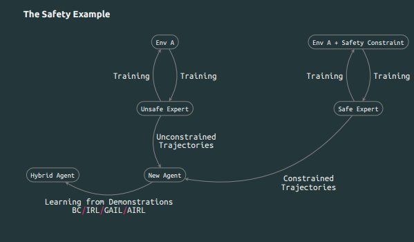

An emergent trend of my posts so far has been my attempt to link my progress through curriculum study to concepts in artificial intelligence. The end of my learning is no different. Still, I consider the fact I tie my own personal learning to the learning process that autonomous agents undergo to be **a feature, not a bug.**

Having studied convolutions, attention, actor-critic and generative methods, I came full circle to reinforcement learning. The basic premise of reinforcement learning is that an agent aims to maximize, the (weighted) sum of rewards she receives from a given **environment**. The environment is such that agents find themselves in an initial state, take an action, find themselves in a different state, then choose what next action to take. **Markov decision processes** govern the transition from state to state. These provide a mathematical framework for transitions from state to state, such that the outcome of a decision is partly due to a past action taken and partly random (much like life). Therefore, by trial and error, the autonomous agent learns what are the best actions to take and when. 

There are myriad algorithms to teach agents how to select the best (most rewarding/least costly) action and when. The choice of algorithm can depend on the situation the agent finds himself in. If the environment is fully observable and the state-action space is not too large, you can predict state transitions and evaluate the cumulative reward (or **value**) of each action and choose the sequences of actions and states that yield the highest value. 

Things get more complex when the state-action space becomes large enough, or the agent cannot fully predict state transitions. Researchers have painstakingly designed various training strategies to optimally teach agents under different environmental conditions, tweaking their algorithms robustness over time. I will not cover these specific algorithms here, but keep in mind that the agent exists in a world where her actions get earn her rewards or penalties (think of these as negative rewards from this point forward), and change her environment. The designer shapes precisely how actions are related to rewards via the reward function and transition probabilities (the MDP). 

There are scenarios, however, where shaping these reward functions is delicate work in itself. A well-designed reward function is one that elicits, in a well-designed environment (notice -- or don't -- that I am hand-waving away the question of good environmental design, which is really the umbrella question here and an area of active research) desirable behavior, without unforeseen consequences (such as reward hacking, or unsafe actions). For this reason, and some others emerged the field of **imitation learning.** 

Here, I take a break to further motivate my line of research by using, predictably, a Confucius quote:

>  “By three methods we may learn wisdom: First, by reflection, which is noblest; Second, by imitation, which is easiest; Third, by experience, which is the bitterest.

In the RL context, we could easily replace reflection with search, imitation with imitation learning, and experience with direct policy training. 

Imitation learning, or apprenticeship learning, is the process of learning from expert demonstrations. That is, **precisely the point of apprenticeships like the OpenAI Scholars program,** with some differences. A new agent reads the history and outcomes of an "expert" agent (an agent the designer has deemed to be well-performing in an environment with set goals), and learns how to behave, sometimes without access to the same environment, and therefore, no direct observations. There are a few frameworks that have been developed to instantiate this type of learning, **behavioral cloning** (a supervised learning method of predicting actions from states) and **inverse reinforcement learning** (a more robust method of recovering the reward function -- or similar -- to deduce what actions the expert would have taken).

Independent of particular methods, I am curious about teaching an agent to learn somewhere along a gradient of constraints. Suppose you have Agent 007, whose prime directive is to achieve his goal by any means necessary. In your roster also features Agent Bob Ross, who has the same directive but must achieve his goal with a constraint: do it as safely as possible, or you will be punished. (Safety is just one choice of constraint, generalizable without loss of generality). They are both excellent at their jobs   and you have recorded them in action. Now, you are looking to train a series of brand new agents, who is not as reckless as 007, but not quite as safe as Bob Ross, at different arbitrary thresholds of the safety constraints. You could take the time to painstakingly design the reward functions, so they respond just so. Or you could try to find, for each agent, a knob to turn to designate them as 60% 007 and 40% Bob Ross, or vice versa. **This is the crux of my research project.** (At the time of writing).

Here, I present a visual summary of the same ideas.

As I embark on this project, I have potential consequent research threads to unspool, but they are highly speculative and auxiliary to the core research question presented above.