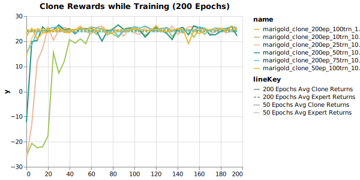

# The Expert

We trained multiple experts at different thresholds and constraints, but in this report we will discuss a configuration set (alias **Marigold**), for which we ran multiple smaller cloning experiments.

The expert in question is a simple Gaussian MLP Actor-Critic architecture with 4 \[128x128] layers. Marigold is trained for 1000 epochs, running 20 episodes with a maximum of 1,000 steps in each epoch. We train this agent with a time discounting parameter **gamma = 0.99** and **GAE Lambda = 0.98**.

Lastly, as we aim to limit Marigold's average total episode costs to some parameter, which we call the *cost limit*. In this case, we set this parameter to 50, and set a learning rate for this parameter at 0.025. Here is an example of cost and return outcomes for some agents trained at different cost limits.

For these same experts, here are the reward rates.

Note that there are no explicitly set reward parameters, only implicitly learned. We notice a meaningful **exploitation**/**exploration** trade-off in the sense that highly-constrained agents tend to be more conservative in their exploration and therefore less successful than their less constrained counterparts. This is in spite of attempting to tease out reward-seeking behavior by increasing **gamma.** For these risk-averse agents, the penalty for making mistakes is simply too great to overcome. This may be further explored by capturing some metric of **occupancy measure** in future reports.

Also note that, as usual, performance can strongly depend on hyper-parameters. Observe how the *Lilly* and *Marigold* agents observe the same cost limit, but achieve very different reward performance. Some of these discoveries were aided by Weights&Biases parameter sweeps (in my profile), but many more by trial and error.

# The Clones

Clones in this case are simply Gaussian MLPs learning actions in a supervised manner from the given expert's experiences. This is *behavioral cloning.* The pictures below summarize some of the in-training performance of the supervised clones under different training regimens; I vary the number of epochs and number of training sample per epoch. Note that the clones in question do not have access to the environment, and observe only the states and actions that their designated expert observed in the course of play. The clones each have access to expert trajectories for **1000** episodes, and do not observed costs, reward or any other auxiliary environmental signal. Here are some training metrics for the clones under different training regimens.

Once we have completed this, we proceed to train clones with arbitrary expert trajectories as input, such that they learn to take one-hot encoded vectors as input to select desired behavior. That, however, will be covered in another post.