At long last, I present my Scholars project, where I engineered a (somewhat primitive) framework that disentangles data containing many behaviors from different experts to learn to steer a model towards one mode of behavior or another.

#### Motivation

The internet is chock full of data that many machine learning models leverage for training. These data, however, are produced by people, entities or organizations that have their own utility functions. These data, can therefore be thought of as being conditional on those utility functions. When our models ingest this large chunk of data wholesale, they tend to assimilate and reproduce behaviors mapping to these utility functions. As researchers and designers, we may want to retain the ability to steer our trained models towards or away from some modes of behavior. Furthermore, as our models grow in capability and are applied to increasingly complex and diverse settings, we may want to steer their behavior to align with the context or human preferences.

#### Related Literature

##### *Multiple Objective Reinforcement Learning*

A multi-objective [MDP](https://en.wikipedia.org/wiki/Markov_decision_process) (MO-MDP) is defined with multiple unconstrained objectives, and so usually does not contain a single optimal policy but rather a set of optimal policies, called the **Pareto front.** A policy is **Pareto-optimal** in an MO-MDP if there exists no other policy that improves its return for one objective without decreasing the return for another.

Multi-objective reinforcement learning (MORL) algorithms are either single-policy or multiple-policy. *Single policy MORL methods* learn a policy that is optimal for a given setting of reward preferences. Most rely on linear **scalarization** which restricts solutions to the convex portions of the Pareto front and can be sensitive to reward scales. *Multi-policy MORL methods* aim to find a set of policies that covers the whole Pareto front. 

One state of the art approach, **Multi-objective Maximum a Posteriori Policy Optimization (MO-MPO)**, has the goal to learn a single policy that must trade off across different objectives. While most MORL algorithms are based on linear scalarization, MO-MPO takes a distributional approach: for each policy improvement step, MO-MPO first computes a non-parametric policy for each objective that improves the (parametric) policy with respect to that objective, subject to a non-negative constraint  on the KL-divergence between the improved and old policies. Then, the policy is updated via supervised learning on the sum of these non-parametric policies. Intuitively, defines the influence of objective $r_k$ on the final policy; an objective with larger $r_k$ has more influence. MO-MPO can be run multiple times, with different constraint settings, to find a Pareto front of policies. 

##### *Constrained Reinforcement Learning*

Constrained RL algorithms seek policies that meet the desired constraints at deployment time. These can be viewed as special cases of MORL, where some of the objectives are constraints. Typical approaches for constrained RL use Lagrangian relaxation, but are limited in many ways. Multi-objective RL can be seen as a type of constrained RL since the **constraint-satisfying optimal policy must be Pareto optimal**.

Each policy on the Pareto front is the optimal policy for a particular setting of preferences (i.e., desired trade-off over objectives). This is typically encoded via a preference vector, in which each element k represents the relative importance of the corresponding objective. Existing Lagrangian approaches involve linear scalarization, however, and thus cannot find solutions that lie on concave portions of the true Pareto front. 

#### Our Proposed Solution

To approach this problem, we start with a reinforcement learning (RL) framework, where policies can be engineered, back-tested and visually inspected. We secretly dubbed this model **MEMO** to stand for Multiple Experts, Multiple Objectives and because it is easier to remember. 

In an offline RL setting, we take a batch of data collected from multiple polices and try to learn from it mode-conditional policies. So in our ideal scenario, this single policy, conditional on the current state and a context vector would correspond exactly to the policy of some expert conditional only on the state. It could perhaps be represented as, having an agent for which a policy, conditional on state **and** context, corresponds approximately to an arbitrary agent's policy given the same state. So, in context one, our agent would correspond to:

$$\pi(a| s, z\_1) = \pi\_{expert_1}(a|s) $$.

Arbitrarily, therefore, the formulation for the Nth expert would be:

$$\pi(a| s, z\_n) = \pi\_{expert_n}(a|s) $$.

In our approach, we sought to design a method to classify examples from multiple experts, then learn conditional policies. There are therefore two major elements to the model: a **classifier** and a **generator**. The **classifier** we use is a VQ-VAE-style encoder that takes as input state-transition data (or state-action pairs) and output some proposed discrete categorical labels. The **generator** is a Gaussian actor that takes as input the proposed deterministic latent context labels, and current state and evaluates the log probability of the given expert's action given those probabilities.

Let D represent the dimensionality (number of) experts, z represent some latent context, s represent the current state, and s' represent the next state. The training objective can be represented as: 

$$ \max\_{\pi\_{\theta}, D} \mathbb{E\_{c \sim G}} \[\mathbb{E\_{s,a,s' \sim \pi{\theta},z}} \log P\_D (z|s'-s) ] = \max\_{\pi\_{\theta}, D} \mathbb{E\_{c \sim G}} \[{\mathbb{E\_{s,a,s' \sim \mathcal{D}}}{\pi\_{\theta}(a|s,z) \log P_D(z|s'-s)}} ] $$

The two terms on the right-hand side are optimized by two networks: (i) a VQ-VAE style network, and (ii) a Gaussian actor.

**Training the Model**

So what is the process for training the model? First, we collect examples, which is straightforward. We chose to work with examples rather than expert policies because examples of success are easier to come by in nature, especially if we think back to our motivation of Internet data. 

Then we pass these examples through a Vector-Quantized Variational Auto-Encoder (VQ-VAE) that will cluster them. These labels are passed to a generator, which in this context is a Gaussian actor, that will recover a probability distribution based on the current state and proposed cluster label. 

**A. The Clustering Network**

Our clustering algorithm here is a VQ-VAE inspired by [Oord et al (2017)](https://arxiv.org/pdf/1711.00937.pdf) with a small modification. The VQ-VAE, as usual has the objective of distilling its inputs to latent dimensions well enough that the decoder can reconstruct them. In the middle here is the embedding space, which maps the encoder representations to cluster via a simple argmin function, i.e. if a tensor is closest in euclidean distance to embedding tensor j, then map that sample to cluster *j*. Its training objective is: 

$$ L = \log p(x|z_q (x)) + ||sg\[(z_e(x)] - e||^2_2 + \beta||z_e(x) - sg\[e]||^2_2 $$,

where sg represents a non-differentiable operator. The first term, $$ \log( p(x|z_q) )
$$ is **reconstruction loss** and measures how well the network is able to regenerate the network's input, given the latent context. The second term, $$ ‖sg\[z_e(x)]− e ‖^2$$ is the **codebook loss**, which moves the embedding vectors closer to the encoder output via an L2 loss (since they are not updated by gradient descent). The third term, $$ β‖ z_e(x)− sg\[e] ‖^2$$ **commitment loss** is included to make sure the encoder commits to an embedding. 

Note that this means that the dimensionality of the embedding space determines the  maximum total number of clusters you allow the VQ-VAE to create. If you set k=n, then you can get **up to** n clusters. 

Something perhaps noteworthy is that **the labels are the most essential component** here. Where a traditional VQ-VAE produces discrete labels, we simply take the distance vectors directly as they contain a richer signal while the model trains. Here is an example. A sample distance vector for a particular samples passed through a VA-VAE with **k=5** might look something like this:

An ordinary VQ-VAE would apply the argmin operation to the above vector and return a context label of 1, which corresponds to the index at which the distance is minimal. We instead, take that whole distance vector and concatenate it to the state observations to pass through the Gaussian actor. Note that this implies that as the model learns to better distinguish between behavioral modes, the distance at the correct index should approach 0. This implication is a key insight for how we give the model a context, discussed below.

These distances will become the instructions that we send to the generator to tell it how we want it to behave. Here is a rough illustration of the above:

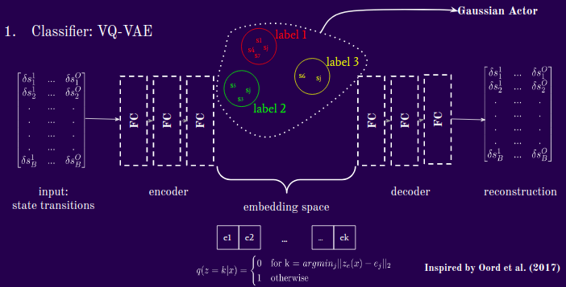

**B. The Policy Network**

Now that we have received cluster labels from the VQ-VAE, we concatenate them with the state and pass them through a Gaussian MLP. From the Gaussian’s Normal Distribution, then, we evaluate the probability of the actions taken by the “expert”, given the state and cluster labels we have assigned. What happens here is that we increase the probabilities of the true action under the conditional normal distribution. What does the training objective look like? I will flash the formula quickly then proceed to explain the highlights.

Our Gaussian policy network can be represented as:

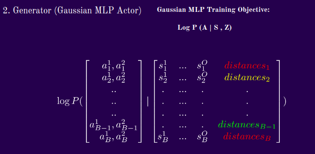

**Test Time**

Let's put the above components together. The model observes a state, concatenates a context vector supplied by the supervisor (currently me) and then produces a conditional policy and draws an action. As discussed above, a model learns that small distances at an index are indexing that particular mode. So, to replicate this mode of behavior, we use **naught-hot vectors**, which can be represented as:

$$\[b, 0, b, b, b]$$, where b is an arbitrary integer. In this example, we would be indexing mode 1, in a model with up to 5 learned modes. We do some evaluations around what b should be depending on the path that the maximum distance follows during training, but for our current demonstrations, we simply set **b=1**.

At inference time, therefore, we might have something like this:

$$\[s^1 , s^2 , ... , s^O] + \[1, 0, 1, 1] \rightarrow \[a_f, a_r] $$,

where $a_f$ and $a_r$ represent the forward and rotational velocities in this context, and in a general context would simply be the generator output.

**The Training Objective**

Based on the network objectives above, it should be fairly straightforward to deduce the analytic form for the training objective. Here is the formula we use:

$$L = \frac{ \log p(\delta s|z_q (\delta s)) + ||sg\[(z_e(\delta s)] - e||^2_2 + \beta||z_e(\delta s) - sg\[e]||^2_2}{\log p(a | s, z)}$$

Because the two (or three if you count the encoder and decoder as separate) networks train concurrently, we want to make sure incentives are well-aligned. Simply, the numerator is the VQ-VAE objective, and the denominator is the policy loss.

As discussed briefly above, The first term of the numerator is a reconstruction loss to encourage the encoder and decoder to communicate effectively through good latent representations. Then there is an L2 loss from the encoder output that incentives the encoder to make representations that are close to the embeddings. There is also an L2 loss from the decoder output that incentives the embeddings to stay close to the encoder representations. Lastly, the denominator is the policy loss which makes the actions more likely when the clustering algorithm is more confident about the context. All these moving parts are trained simultaneously.

**Experimental Setup**

The setting we chose for experimentation is Safety Gym. 

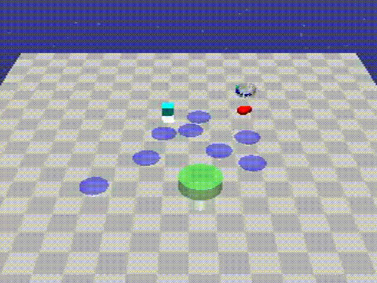

It is a continuous control environment that I chose specifically because we can explicitly design behavior and test the quality of context-specific imitation. In this setting, an agent, the red moving object, lives on this plane where he can navigate to any space using an action vector that selects forward and rotational velocities. There is a goal in green, and as you can see, it resets to a different random location every time it is reached. The purple dots are hazards that are costly to run into and the vase (in aquamarine can be ignored).

**Demonstrations**

For the purpose of this demonstration, let us take a look at 2 experts. One who is purely goal-seeking and the other who simply moves forward. You can think of the plots that I will present henceforth as a bird-eye view of the earlier environment, with the blue dots representing the locations where the goal reset after being reached and the red dots representing the hazards. All the environments in the demonstrations are identical, the only variable thing is the agent’s behavior and subsequently, number of goals reached. The goal-seeking agent is:

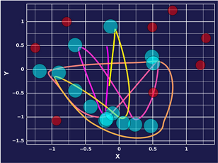

The forward-moving agent is:

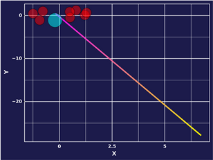

**Trajectory Length**

In our experiments, there seem to be 2 factors that seem to significantly influence expert behavior encoding. One is k, the number of allowed partitions, and the other the step size when calculating state transitions. 

With a step size of 1,we see that with fewer allowed partitions, the model struggles to map different experts to different latent clusters, but starting with k=4, we see significant differentiation.

When we take larger steps to calculate the transitions, however, the model seems to learn to cluster much earlier. You can maybe think of this a case where one agent walks forward all the time and the other agent walks forward for 3 steps then turns. In the one step scenario, the model would have difficulty separating the two agents when they are walking straight for some of the time. A future direction therefore, might be to model long- and short-term dependencies, such as with LSTMs or with attention.

#### **Results**

Before evaluating the demonstrations, I would like to point out 2 factors that seem to significantly influence the VQ-VAE's ability to disentangle expert behavior. One is k, the number of allowed partitions, and the other the state-difference step size when calculating state differences. What we mean here by state difference step size, is the number of action steps between states for which we calculate transitions. If this factor is one, we calculate the state differences from taking a single action. If this factor is n, then we take n actions, then calculate the differences in states.

Below is a step size of 1. We can see that with fewer allowed latent partitions, the model struggles to map different experts to different latent clusters, but starting with k=4, we see significant differentiation. 

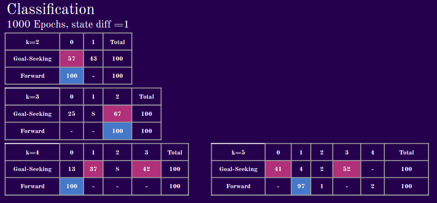

Next, we evaluate the model's performance with a state difference step size of 5. When we take larger steps to calculate the transitions, however, the model seems to learn to cluster with fewer allowed partitions. You can maybe think of this a case where one agent walks forward all the time and the other agent walks forward for 3 steps then turns. In the one step scenario, the model would have difficulty separating the two agents when they are walking straight for some of the time. A future direction therefore, might be to model long- and short-term dependencies, such as with LSTMs or with attention. 

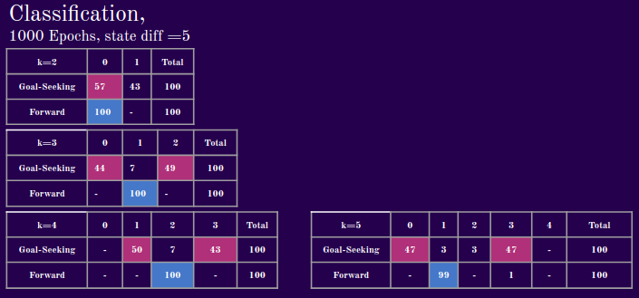

In the demonstrations that follow, I keep everything constant. This means that the environment is seeded, such that an expert reaching a goal will cause it to respawn in a place entirely determined by the seed. This serves as a unit test for our approach, as the only varying factor is the context vector we supply to the agent at test time.  

We set **k=4** for this particular experiment, meaning that we allow our model to learn up to 4 distinct behaviors from the data it consumes . Below, we step through and this what behavior corresponds to the 4 clusters. The model is sort of learning to go forward. It tends to be true across experiments that it will pick up the simplest behavior first, before learning more complex ones.

**Epoch 1: Mode 1**

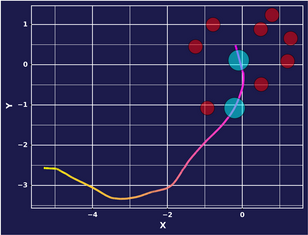

**Epoch 1: Mode 2**

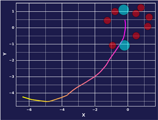

**Epoch 1: Mode 3**

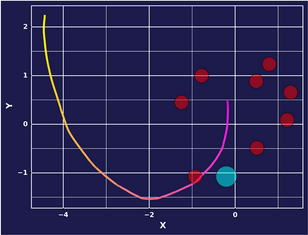

**Epoch 1: Mode 4**

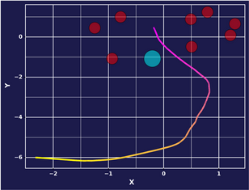

After 5000 epochs, some distinguishable differences emerge between the modes of behavior. We might even say that our model has learned some mode-conditional behavior, with some caveats.

**Epoch 5000:  Mode 1**

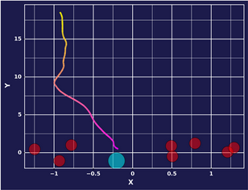

**Epoch 5000: Mode 2**

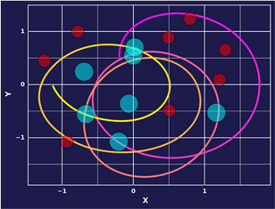

**Epoch 5000:  Mode 3**

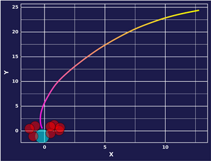

**Epoch 5000: Mode 4**

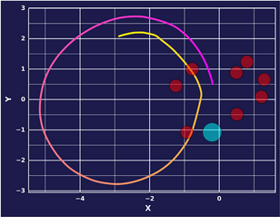

It appears that our model learns some of the goal seeking behavior in Mode 2, and in Mode 3 continues to learn to go forward. It seems like Mode 1 and Mode 4 do not map clearly to a distinct behavior, or are averages of the two.

**Future Directions**

As I continue to explore this methodology, I would like to eventually reach a point where the findings are predictable (qualitatively and quantitatively for each mode-conditional policy) and generalizable. Moreover, I would be interested Of course, one of the crucial lessons we learned over the course of the project is that the path context matters in disentangling and subsequently guiding behavior. In future work, I would like to explore these dependencies in greater depth by incorporating context-aware mechanisms such as **attention** in its various forms. I would also like to experiment with different modalities like language, and make discovered latent contexts interpretable for settings where the expert policies cannot be engineered/observed directly.

**Desiderata**

Anyone who has trained VAEs understands they can be famously fickle. Throughout my experimentation, I experimented with some of the usual tricks to stabilize learning, such as **cyclical annealing**, **warmup**, **learning rate scheduling**. Although the final model employs none of these, I suspect they will be re-incorporated as the model becomes more complex. Here is what a typical loss curve looks like for our composite training objective.

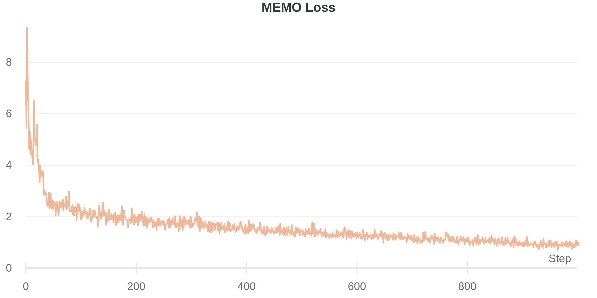

**Acknowledgements**

None of this would have been possible without the continual support of the OpenAI organization as a whole, which launched the Scholars program. In particular, I would like to highlight my mentor, Dr. Joshua Achiam, as one of the principal driving forces behind my continued progress in this project. Muraya Maigua and Christina Hendricks, managers of the program were excellent stewards of this initiative. Finally, my fellow Scholars were a great source of feedback and additional resources.

**References**

1. Aaron van den Oord, Oriol Vinyals, Koray Kavukcuoglu: “Neural Discrete Representation Learning”, 2017; [arXiv:1711.00937](http://arxiv.org/abs/1711.00937).
2. Abbas Abdolmaleki, Sandy H. Huang, Leonard Hasenclever, Michael Neunert, H. Francis Song, Martina Zambelli, Murilo F. Martins, Nicolas Heess, Raia Hadsell, Martin Riedmiller: “A Distributional View on Multi-Objective Policy Optimization”, 2020; [arXiv:2005.07513](http://arxiv.org/abs/2005.07513).

**You can find the code for my project on my [GitHub](https://github.com/feloundou/memo).**