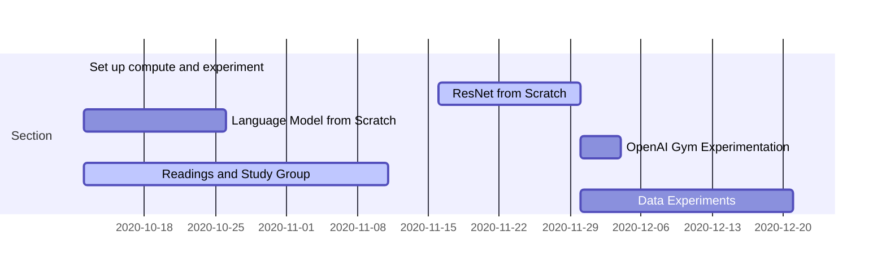

Ten days into the journey, the excitement has yet to wear off. Everything looks shiny and new, and for me, every new (good) paper read is full of discovery and unspools new threads of thought. However, it is important that I keep myself grounded and on pace.

My scholars class has been given ample resources by way of mentorship, compute, repositories, texts and guidelines. Still, I expect this process to be windy, and maybe the only way to plan for chaos is to plan flexibly. Therefore, while I have made a schedule for my learning, it is up to change. Nevertheless, here is what I have so far:

