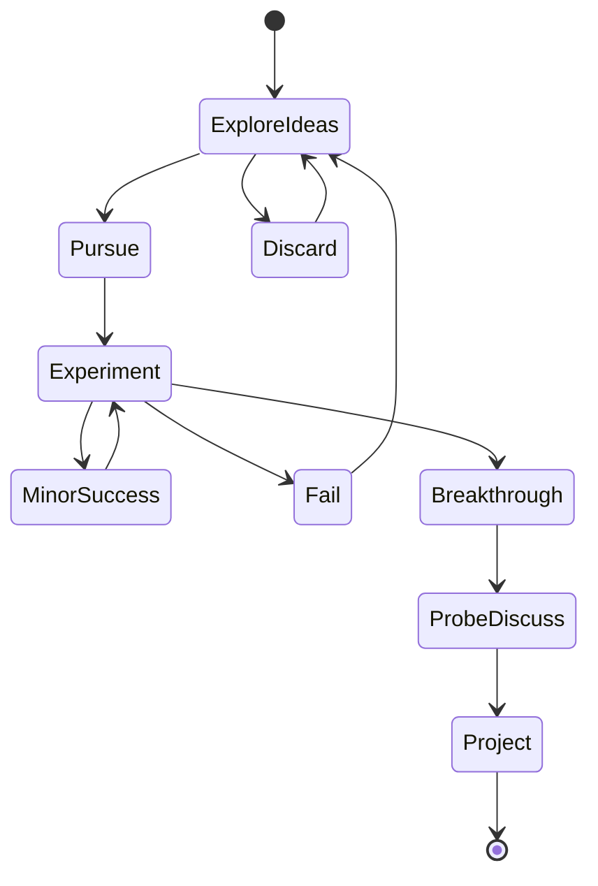

Ten days into the journey, the excitement has yet to wear off. Everything looks shiny and new, and for me, every new (good) paper read is full of discovery and unspools new threads of thought. However, it is important that I keep myself grounded and on pace.

My scholars class has been given ample resources: mentorship, compute, repositories, texts and guidelines. Still, I expect this process to be windy from start to finish, perhaps looking like this:





My plan, therefore, is to plan for flexibility. While my mentor and I have made a schedule for my learning, it is up to change, subject to new ideas and findings. Nevertheless, here is a rough idea of what I will be aiming for: 


```mermaid
gantt
section Gantt
Compute set-up :done,    des1, 2020-10-12,2020-10-23
ResNet in PyTorch      :active,  des2, 2020-10-16, 14d
Language Model in PyTorch:         des3, after des1, 14d
OpenAI Gym Expts:         des4, after des2, 4d
Readings and Study Group: active, des5, after des1, 30d
Data Experiments:         des6, after des2, 21d
Research Plan:            des7, 2020-11-15,2020-11-30
Research Project:         des8, 2020-12-01-2021-04-01
Presentation:             des9, after des8
```


I am thankful for the 
on Microsoft Azure!
 that we have been granted, which releases us from what I imagine would be most project ideation constraints. In essence, we can attempt nearly anything that can conceivably be attempted with modern computing power. 

My technical set-up is relatively simple, and has involved:

- [x] Set up Microsoft VM according to desired specs
- [x] Generate SSH keys for access via terminal tunnel
- [x] Install desired packages
- [x] Enable Jupyter notebook to run remotely on VM, via port forwarding
- [ ] As best practice, when trying to work with specific tutorials where one can anticipate package version conflicts, work within virtual environments


For the next few weeks, I plan to complete the first 3 experiments I have in mind, and be on strong enough footing to pursue one or two passable ideas. See you then.


